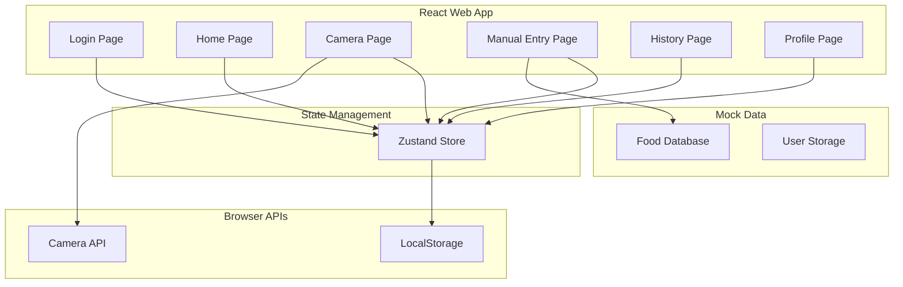

# 热量记录APP - 技术架构文档

## 1. Architecture Design



## 2. Technology Description
- **Frontend**: React@18 + TypeScript + Tailwind CSS@3 + Vite
- **State Management**: Zustand
- **Router**: React Router DOM@6
- **Icons**: Lucide React
- **Storage**: LocalStorage (for persistence)
- **Camera**: MediaDevices API (browser-native)

## 3. Route Definitions
| Route | Purpose |
|-------|---------|
| / | 首页 - 今日热量统计和记录 |
| /login | 登录页面 |
| /camera | 拍照识别页面 |
| /manual | 手动记录页面 |
| /history | 历史记录页面 |
| /profile | 个人中心页面 |

## 4. Data Types

```typescript
// 用户信息
interface User {
  id: string;
  name: string;
  avatar?: string;
  loginMethod: 'qq' | 'wechat' | 'phone';
  dailyCalorieGoal: number;
}

// 食物信息
interface Food {
  id: string;
  name: string;
  caloriesPer100g: number;
  image?: string;
  category: string;
}

// 饮食记录
interface MealRecord {
  id: string;
  userId: string;
  foodId: string;
  foodName: string;
  weight: number;
  calories: number;
  mealType: 'breakfast' | 'lunch' | 'dinner' | 'snack';
  timestamp: string;
  image?: string;
}

// 每日统计
interface DailyStats {
  date: string;
  totalCalories: number;
  records: MealRecord[];
}
```

## 5. State Management (Zustand Store)

```typescript
interface AppState {
  user: User | null;
  records: MealRecord[];
  foods: Food[];
  
  // Actions
  login: (method: 'qq' | 'wechat' | 'phone', userData?: Partial<User>) => void;
  logout: () => void;
  addRecord: (record: Omit<MealRecord, 'id' | 'userId' | 'timestamp'>) => void;
  deleteRecord: (recordId: string) => void;
  getDailyStats: (date: string) => DailyStats;
  getRecordsByDate: (date: string) => MealRecord[];
  setDailyGoal: (calories: number) => void;
}
```

## 6. Mock Food Database

预设常见食物数据，包括：
- 主食类：米饭、面条、面包等
- 肉类：鸡肉、牛肉、猪肉等
- 蔬菜类：青菜、番茄、黄瓜等
- 水果类：苹果、香蕉、橙子等
- 饮品类：牛奶、咖啡、奶茶等

## 7. Core Features Implementation

### 7.1 Camera Feature
- 使用 `navigator.mediaDevices.getUserMedia()` 调用摄像头
- 拍照后使用Canvas获取图片数据
- 模拟AI识别（实际项目可接入第三方API）

### 7.2 Calorie Calculation
```typescript
const calculateCalories = (food: Food, weight: number): number => {
  return Math.round((food.caloriesPer100g * weight) / 100);
};
```

### 7.3 Data Persistence
- 使用 LocalStorage 存储用户数据和记录
- 应用启动时从 localStorage 加载数据
- 数据变更时自动保存到 localStorage

## 8. Component Structure
```
src/
├── components/
│   ├── CalorieRing.tsx       # 热量圆环组件
│   ├── MealCard.tsx          # 餐食卡片
│   ├── FoodSelector.tsx      # 食物选择器
│   └── BottomNav.tsx         # 底部导航
├── pages/
│   ├── Login.tsx             # 登录页
│   ├── Home.tsx              # 首页
│   ├── Camera.tsx            # 拍照页
│   ├── ManualEntry.tsx       # 手动记录页
│   ├── History.tsx           # 历史记录页
│   └── Profile.tsx           # 个人中心
├── store/
│   └── useAppStore.ts        # Zustand store
├── data/
│   └── foods.ts              # 食物数据库
├── types/
│   └── index.ts              # TypeScript 类型
├── App.tsx
└── main.tsx
```
