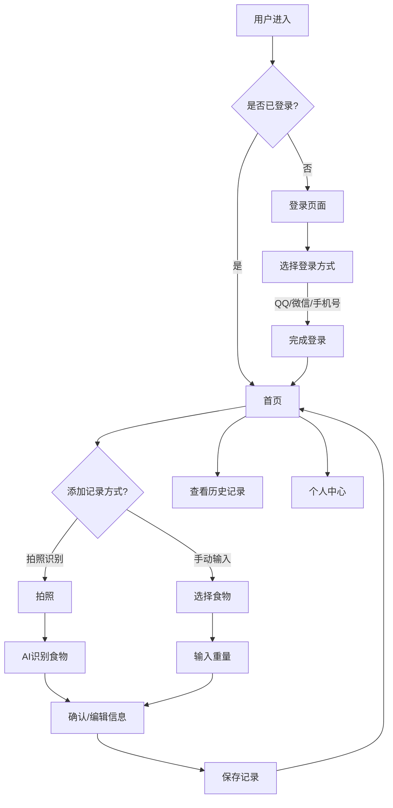

# 热量记录APP - 产品需求文档 (PRD)

## 1. Product Overview

一款用于记录日常饮食热量的移动端Web应用，支持拍照自动识别食物热量和手动编辑功能，帮助用户追踪每日热量摄入。目标用户为关注健康饮食、减肥或健身的人群，提供免费、便捷的热量管理解决方案。

## 2. Core Features

### 2.1 User Roles
| Role | Registration Method | Core Permissions |
|------|---------------------|------------------|
| Normal User | QQ/微信/手机号登录 | 使用所有功能、管理个人数据 |

### 2.2 Feature Module
1. **登录页面**: 用户认证入口，支持多种登录方式
2. **首页**: 每日热量统计、快捷添加记录
3. **拍照识别**: 拍照自动识别食物和计算热量
4. **手动记录**: 手动选择食物、输入重量计算热量
5. **历史记录**: 查看和管理历史饮食记录
6. **个人中心**: 用户信息管理

### 2.3 Page Details
| Page Name | Module Name | Feature description |
|-----------|-------------|---------------------|
| 登录页面 | 登录按钮 | 显示QQ、微信、手机号三种登录方式 |
| 首页 | 热量统计 | 圆环进度条显示今日热量摄入 |
| 首页 | 今日餐食 | 列表展示今日所有饮食记录 |
| 拍照识别 | 相机预览 | 调用摄像头拍摄食物 |
| 拍照识别 | 识别结果 | 显示识别出的食物和预估热量 |
| 手动记录 | 食物选择器 | 预设食物库，支持搜索 |
| 手动记录 | 重量输入 | 输入食物重量，自动计算热量 |
| 历史记录 | 日期选择 | 按日期查看历史记录 |
| 历史记录 | 记录列表 | 展示所选日期的所有记录 |

## 3. Core Process

用户登录 → 查看今日热量统计 → 添加新记录（拍照或手动） → 保存记录 → 查看历史数据 → 管理个人信息

## 4. User Interface Design

### 4.1 Design Style
- **Primary Colors**: 绿色系 (#10B981) - 代表健康、活力
- **Secondary Colors**: 浅绿 (#D1FAE5)、橙色 (#F59E0B) - 用于警告和强调
- **Button Style**: 圆角按钮，带轻微阴影，点击有按压反馈
- **Fonts**: 现代无衬线字体，标题18-24px，正文14-16px
- **Layout**: 卡片式设计，顶部导航栏，底部功能标签栏
- **Icon Style**: 简约线性图标，与健康主题匹配

### 4.2 Page Design Overview
| Page Name | Module Name | UI Elements |
|-----------|-------------|-------------|
| 登录页面 | 登录区域 | 居中卡片，三个社交登录按钮，渐变背景 |
| 首页 | 统计圆环 | 大尺寸圆环进度条，动态动画展示热量占比 |
| 首页 | 餐食卡片 | 白色卡片，左对齐食物图片，右侧显示名称和热量 |
| 拍照识别 | 相机界面 | 全屏相机预览，底部拍照按钮 |
| 手动记录 | 食物列表 | 网格布局，带食物图片、名称、单位热量 |
| 历史记录 | 时间轴 | 垂直时间轴，按时间分组显示记录 |

### 4.3 Responsiveness
- 移动端优先设计，适配iPhone和Android主流尺寸
- 触摸优化，按钮尺寸≥44px
- 支持横屏和竖屏切换

### 4.4 Icon Guidance
使用健康、食物相关的图标：
- 🍎 食物记录
- 📸 拍照识别
- 📊 统计数据
- 📅 历史记录
- 👤 个人中心
